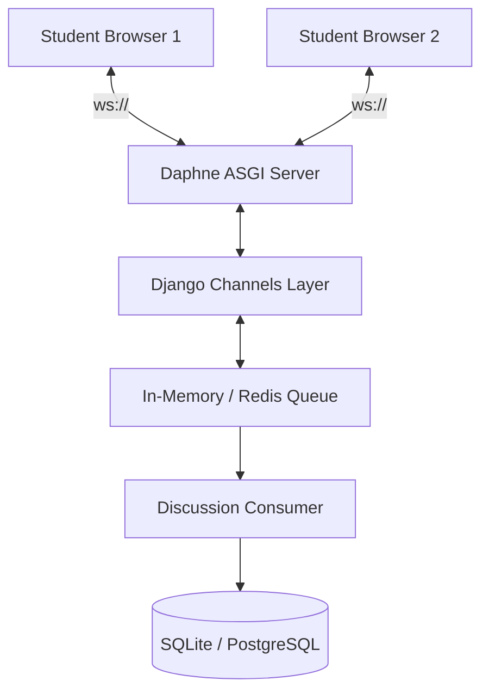

<div align="center">
  
  <h1>🏫 CampusNest (Solo HMS)</h1>
  <p><strong>Next-Generation Hostel Management & Student Ecosystem</strong></p>
  
  [](https://python.org)
  [](https://djangoproject.com)
  [](https://channels.readthedocs.io/)
  [](https://stripe.com)
</div>

---

## 🌟 Overview

**CampusNest** transforms traditional, fragmented hostel administration into a unified, intelligent, and highly aesthetic digital ecosystem. It bridges the gap between administrative oversight and student living, providing real-time interactions, streamlined workflows, and a vibrant community platform.

Unlike traditional management systems, CampusNest treats the campus as a living entity, integrating **True Real-Time WebSockets**, visual maintenance tracking, and an extensive student portal.

---

## 🚀 Core Modules & Features

### 🏢 **Administrative Command Center**
*   **Intelligent Dashboard:** Real-time metrics, dynamic charts, and financial overviews at a glance.
*   **Smart Room Allocation:** Automated assignment algorithms with visual room tracking.
*   **SLA-Driven Maintenance:** Complaint tracking with automated **Urgency Color-Coding** (🔥 flagged if pending > 48hrs) and integrated photo evidence viewers.
*   **Role-Based Access Control:** Secure, multi-tiered staff privileges.

### 🎓 **Student Portal & Services**
*   **Digital Outpass System:** Request, track, and manage leave permissions seamlessly.
*   **Room Change Requests:** Automated workflows for inter-hostel transfers.
*   **Integrated Payments:** Frictionless fee collection powered by **Stripe API**.
*   **Profile Customization:** Avatar uploads and personalized dashboards.

### 🤝 **CampusConnect (The Community Hub)**
*   **Real-Time Discussion Center:** Zero-latency WebSocket chat rooms built with **Django Channels & Daphne** for instant peer-to-peer communication.
*   **Smart Mess Menu:** Dynamic 6x7 weekly matrices for breakfast, lunch, snacks, dinner, and additional meals.
*   **Digital Marketplace:** Secure peer-to-peer textbook and dorm equipment trading.
*   **Lost & Found:** Visual inventory of lost items to help students recover belongings quickly.
*   **Event & Club Management:** Centralized campus life calendar with poster uploads and club affiliations.

---

## 🧠 Real-Time Architecture

CampusNest utilizes an asynchronous architecture to power its live community features. Instead of relying on expensive HTTP polling, it maintains persistent TCP connections.



---

## 🛠️ Technology Stack

| Category | Technologies |
| :--- | :--- |
| **Backend Framework** | Django 4.2+ (Python) |
| **Asynchronous Server** | Daphne, Django Channels |
| **Database** | SQLite (Dev) / PostgreSQL (Prod) |
| **Frontend Architecture** | Modern Glassmorphism UI, Vanilla CSS Variables, HTML5 |
| **Typography** | Plus Jakarta Sans |
| **Payment Gateway** | Stripe API |

---

## 💻 Installation & Setup

### Prerequisites
- Python 3.9+
- Git

### 1. Clone the repository
```bash
git clone https://github.com/yourusername/solo-hms.git
cd solo-hms
```

### 2. Environment Setup
```bash
python -m venv myenv

# Windows:
myenv\Scripts\activate
# macOS/Linux:
source myenv/bin/activate
```

### 3. Install Dependencies
```bash
pip install -r requirements.txt
```

### 4. Configuration
Create a `.env` file in the root directory and add your Stripe API keys:
```env
STRIPE_PUBLIC_KEY=pk_test_your_key_here
STRIPE_SECRET_KEY=sk_test_your_key_here
```

### 5. Database Setup & Execution
Run migrations to build the database schema, then start the asynchronous server:
```bash
python manage.py makemigrations
python manage.py migrate
python manage.py runserver
```
> **Note:** Because `daphne` is installed, `runserver` automatically serves the ASGI application, enabling WebSockets right out of the box!

---

## 📁 Directory Structure
```text
solo-hms/
├── Hostel/               # Core project settings and ASGI/WSGI configs
├── Hostels/              # Main hostel management app (allocations, outpass, payments)
├── app2/                 # CampusConnect app (forums, marketplace, events, mess menu)
├── media/                # User uploaded content (avatars, evidence photos, posters)
├── static/               # Core CSS, JavaScript, and static assets
├── templates/            # Global HTML templates
└── manage.py             # Django entry point
```

---

## 🤝 Contributing
Contributions are welcome! Please follow the standard fork-and-pull request workflow.
1. Fork the project.
2. Create your feature branch (`git checkout -b feature/AmazingFeature`).
3. Commit your changes (`git commit -m 'Add some AmazingFeature'`).
4. Push to the branch (`git push origin feature/AmazingFeature`).
5. Open a Pull Request.

---

<div align="center">
  <i>Developed to redefine institutional living. Designed with ❤️ for students.</i>
</div>
